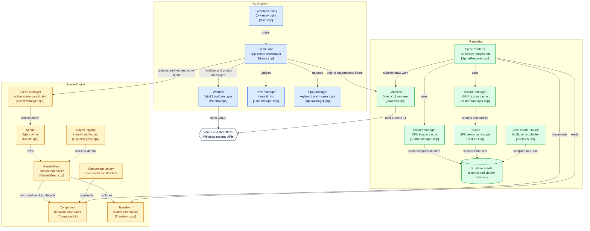

# Git Diagram

```mermaid
flowchart TD

subgraph group_app["Application"]
  node_main["Executable entry<br/>C++ entry point<br/>[Main.cpp]"]
  node_game["Game loop<br/>application coordinator<br/>[Game.cpp]"]
  node_window["Window<br/>Win32 platform layer<br/>[Window.cpp]"]
  node_time["Time manager<br/>frame timing<br/>[TimeManager.cpp]"]
  node_input["Input manager<br/>keyboard and mouse input<br/>[InputManager.cpp]"]
end

subgraph group_engine["Scene Engine"]
  node_scene_manager["Scene manager<br/>active scene coordinator<br/>[SceneManager.cpp]"]
  node_scene["Scene<br/>object owner<br/>[Scene.cpp]"]
  node_game_object["GameObject<br/>component owner<br/>[GameObject.cpp]"]
  node_component["Component<br/>behavior base class<br/>[Component.h]"]
  node_transform["Transform<br/>spatial component<br/>[Transform.cpp]"]
  node_component_factory["Component factory<br/>component construction"]
  node_object_registry["Object registry<br/>identity and lookup<br/>[ObjectRegistry.cpp]"]
end

subgraph group_render["Rendering"]
  node_graphics["Graphics<br/>DirectX 11 renderer<br/>[Graphics.cpp]"]
  node_shader_manager["Shader manager<br/>GPU shader cache<br/>[ShaderManager.cpp]"]
  node_texture_manager["Texture manager<br/>GPU texture cache<br/>[TextureManager.cpp]"]
  node_texture["Texture<br/>GPU resource wrapper<br/>[Texture.cpp]"]
  node_sprite_renderer["Sprite renderer<br/>2D render component<br/>[SpriteRenderer.cpp]"]
  node_sprite_shaders["Sprite shader source<br/>HLSL vertex shader<br/>[SpriteVS.hlsl]"]
  node_runtime_assets[("Runtime assets<br/>textures and shader bytecode")]
end

node_win32_dx11{{"Win32 and DirectX 11<br/>Windows runtime APIs"}}

node_main -->|"starts"| node_game
node_game -->|"initializes and pumps messages"| node_window
node_game -->|"updates"| node_time
node_game -->|"updates"| node_input
node_game -->|"updates and renders active scene"| node_scene_manager
node_game -->|"begins and presents frame"| node_graphics
node_window -->|"uses Win32"| node_win32_dx11
node_graphics -->|"uses DirectX 11"| node_win32_dx11
node_scene_manager -->|"selects active"| node_scene
node_scene -->|"owns"| node_game_object
node_game_object -->|"owns and invokes lifecycle"| node_component
node_game_object -->|"includes"| node_transform
node_component_factory -->|"constructs"| node_component
node_object_registry -.->|"indexes identity"| node_game_object
node_sprite_renderer -->|"implements"| node_component
node_sprite_renderer -->|"reads"| node_transform
node_sprite_renderer -->|"submits draw work"| node_graphics
node_sprite_renderer -->|"uses"| node_shader_manager
node_sprite_renderer -->|"uses"| node_texture_manager
node_shader_manager -->|"loads compiled shaders"| node_runtime_assets
node_texture_manager -->|"creates and caches"| node_texture
node_texture -->|"loads texture files"| node_runtime_assets
node_sprite_shaders -.->|"compiled into .cso"| node_runtime_assets

click node_main "https://github.com/magotoolivesource/directxproj/blob/main/src/Main.cpp"
click node_game "https://github.com/magotoolivesource/directxproj/blob/main/src/Core/Game.cpp"
click node_window "https://github.com/magotoolivesource/directxproj/blob/main/src/Core/Window.cpp"
click node_time "https://github.com/magotoolivesource/directxproj/blob/main/src/Core/TimeManager.cpp"
click node_input "https://github.com/magotoolivesource/directxproj/blob/main/src/Input/InputManager.cpp"
click node_scene_manager "https://github.com/magotoolivesource/directxproj/blob/main/src/Engine/SceneManager.cpp"
click node_scene "https://github.com/magotoolivesource/directxproj/blob/main/src/Engine/Scene.cpp"
click node_game_object "https://github.com/magotoolivesource/directxproj/blob/main/src/Engine/GameObject.cpp"
click node_component "https://github.com/magotoolivesource/directxproj/blob/main/src/Engine/Component.h"
click node_transform "https://github.com/magotoolivesource/directxproj/blob/main/src/Engine/Transform.cpp"
click node_component_factory "https://github.com/magotoolivesource/directxproj/blob/main/src/Engine/ComponentFactory.cpp"
click node_object_registry "https://github.com/magotoolivesource/directxproj/blob/main/src/Core/ObjectRegistry.cpp"
click node_graphics "https://github.com/magotoolivesource/directxproj/blob/main/src/Core/Graphics.cpp"
click node_shader_manager "https://github.com/magotoolivesource/directxproj/blob/main/src/Graphics/ShaderManager.cpp"
click node_texture_manager "https://github.com/magotoolivesource/directxproj/blob/main/src/Graphics/TextureManager.cpp"
click node_texture "https://github.com/magotoolivesource/directxproj/blob/main/src/Graphics/Texture.cpp"
click node_sprite_renderer "https://github.com/magotoolivesource/directxproj/blob/main/src/Engine/SpriteRenderer.cpp"
click node_sprite_shaders "https://github.com/magotoolivesource/directxproj/blob/main/Shaders/SpriteVS.hlsl"

classDef toneNeutral fill:#f8fafc,stroke:#334155,stroke-width:1.5px,color:#0f172a
classDef toneBlue fill:#dbeafe,stroke:#2563eb,stroke-width:1.5px,color:#172554
classDef toneAmber fill:#fef3c7,stroke:#d97706,stroke-width:1.5px,color:#78350f
classDef toneMint fill:#dcfce7,stroke:#16a34a,stroke-width:1.5px,color:#14532d
classDef toneRose fill:#ffe4e6,stroke:#e11d48,stroke-width:1.5px,color:#881337
classDef toneIndigo fill:#e0e7ff,stroke:#4f46e5,stroke-width:1.5px,color:#312e81
classDef toneTeal fill:#ccfbf1,stroke:#0f766e,stroke-width:1.5px,color:#134e4a
class node_main,node_game,node_window,node_time,node_input toneBlue
class node_scene_manager,node_scene,node_game_object,node_component,node_transform,node_component_factory,node_object_registry toneAmber
class node_graphics,node_shader_manager,node_texture_manager,node_texture,node_sprite_renderer,node_sprite_shaders,node_runtime_assets toneMint
class node_win32_dx11 toneNeutral
```
