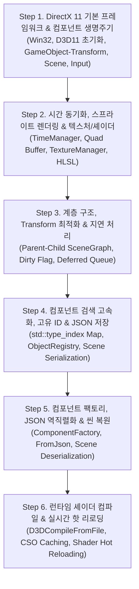

# DirectX 11 게임 프레임워크 단계별 학습 & AI 프롬프트 가이드
> **문서 대상**: DirectX 11 및 C++ 게임 엔진 아키텍처를 학습하는 학생 및 주니어 개발자  
> **프로젝트 기준**: `Base_FrameWork_Proj_V1/DirectXProj`  
> **기반 원본 문서**: `기본프레임워크 만들기.md`

---

## 📌 전체 학습 로드맵 개요

본 문서는 Julius AI 및 생성형 AI 도구를 활용하여 Unity 스타일의 **DirectX 11 게임 엔진 프레임워크(`DirectXProj`)**를 바닥부터 점진적으로 구축해 나갈 때 필요한 **AI 프롬프트**, **선행 기술 학습 내용**, **결론 및 테스트 검증 절차**를 6단계로 체계화한 학습 가이드입니다.



---

## 📖 단계별 상세 학습 가이드

---

### [Step 1] DirectX 11 기본 윈도우 생성 및 GameObject-Component 프레임워크 기반 구축

#### 💬 1. 프롬프트 (AI 지시문)
```text
DirectX 11을 기반으로 Unity 엔진과 유사한 GameObject-Component 아키텍처를 갖는 기본 게임 프레임워크를 작성해줘.

[요구사항]
1. Win32 Window 생성 및 메시지 루프를 캡슐화한 Window 클래스를 작성해줘.
2. DirectX 11 디바이스, 스왑체인, 렌더 타겟 뷰를 초기화하고 배경을 파란색(Clear Color)으로 지우는 Graphics 클래스를 구현해줘.
3. 키보드와 마우스 입력을 관리하는 InputManager 싱글톤 클래스를 만들어줘.
4. Component 기본 추상 클래스를 정의하고, Start(), Update(), Render(), OnDestroy() 가상 메서드를 포함해줘.
5. 위치/회전/크기를 표현하는 Transform 컴포넌트를 만들고, GameObject 생성 시 기본으로 포함되도록 해줘.
6. GameObject는 여러 Component를 부착(AddComponent) 및 검색(GetComponent)할 수 있어야 하며, 생명주기 함수를 순회 호출해야 해.
7. Scene과 SceneManager를 구현하여 활성화된 씬 내의 모든 GameObject를 일괄 업데이트 및 렌더링하도록 해줘.
8. 위 시스템을 통합 실행하는 Game 클래스와 main(WinMain) 함수 진입점을 구성해줘.
```

#### 🧠 2. 선행학습 (필수 기술 및 이론)
1. **Win32 API 프로그래밍 기초**:
   - `WinMain` 진입점, `WNDCLASSEX` 윈도우 클래스 등록, `CreateWindowEx` 창 생성.
   - 메시지 루프 처리 (`PeekMessage` vs `GetMessage`의 차이점: 논블로킹 게임 렌더 루프 구현 원리).
   - 윈도우 프로시저(`WndProc`) 메시지 디스패치 (`WM_DESTROY`, `WM_SIZE`, `WM_KEYDOWN`, `WM_MOUSEMOVE` 등).
2. **DirectX 11 렌더링 파이프라인 초기화**:
   - `D3D11CreateDeviceAndSwapChain`: 그래픽 하드웨어 디바이스(`ID3D11Device`) 및 커맨드 실행 컨텍스트(`ID3D11DeviceContext`), 프론트/백 버퍼 교체기(`IDXGISwapChain`) 생성.
   - 백버퍼로부터 `ID3D11RenderTargetView`(RTV) 생성 및 `OMSetRenderTargets` 파이프라인 바인딩.
   - `D3D11_VIEWPORT` 설정 및 `ClearRenderTargetView`, `Present`를 이용한 더블 버퍼링 화면 클리어.
3. **컴포넌트 기반 아키텍처 (GameObject-Component Pattern)**:
   - 객체지향 상속의 한계를 극복하고 합성(Composition)을 활용하는 게임 엔진 핵심 구조.
   - 가상 함수 다형성(`virtual void Update() = 0`) 및 생명주기(Lifecycle: Start -> Update -> Render -> Destroy) 호출 순서 설계.
4. **C++ 객체지향 및 스마트 포인터**:
   - `std::unique_ptr` 및 `std::shared_ptr`을 통한 리소스 및 메모리 소유권 관리.
   - 싱글톤 패턴(Singleton Pattern)의 동작 원리 및 전역 시스템 매니저 관리.

#### 🎯 3. 결론 및 테스트할 것
- [ ] **윈도우 및 화면 클리어**: 1280x720 해상도의 창이 생성되고 깜빡임 없이 진한 파란색(`0.1f, 0.2f, 0.6f, 1.0f`)으로 화면이 지워지는지 확인.
- [ ] **창 이벤트 처리**: 윈도우 창 닫기 버튼(X)을 누르거나 `Alt + F4` 입력 시 메인 루프를 탈출하여 정상 종료되는지 확인.
- [ ] **키/마우스 입력 수신**: `InputManager::IsKeyDown(VK_SPACE)` 또는 마우스 클릭 시 로그 출력이나 분기 동작이 정상 작동하는지 확인.
- [ ] **컴포넌트 생명주기 검증**: 임의의 테스트 컴포넌트를 `GameObject`에 추가하여 `Start()`가 최초 1회 호출되고, 매 프레임 `Update()`와 `Render()`가 호출되는지 확인.
- [ ] **안전한 종료**: 프로그램 종료 시 그래픽 디바이스와 씬 매니저 리소스가 누수 없이 `Shutdown()`되는지 확인.

---

### [Step 2] 시간 동기화(TimeManager), 스프라이트 렌더링(SpriteRenderer) 및 텍스처/셰이더 파이프라인

#### 💬 1. 프롬프트 (AI 지시문)
```text
프레임워크에 시간 관리와 2D 스프라이트 렌더링 시스템을 추가해줘.

[요구사항]
1. 고해상도 타이머를 기반으로 프레임 간 경과 시간(Delta Time)과 총 경과 시간을 측정하는 TimeManager 싱글톤을 구현해줘.
2. WIC(Windows Imaging Component)를 사용하여 이미지 파일(PNG, JPG 등)을 읽어 ID3D11ShaderResourceView로 생성하고 캐싱 관리하는 TextureManager 싱글톤을 만들어줘.
3. 사각형(Quad) 정점(Vertex: Position, UV) 버퍼와 인덱스 버퍼를 생성하고 화면에 텍스처를 렌더링하는 SpriteRenderer 컴포넌트를 구현해줘.
4. 스프라이트 렌더링을 위한 기본 HLSL 셰이더(SpriteVS.hlsl, SpritePS.hlsl)를 작성해줘.
5. Graphics 클래스에서 셰이더, 정점 버퍼, 상수 버퍼(월드-뷰-프로젝션 행렬), 텍스처 샘플러 상태(SamplerState)를 파이프라인에 바인딩할 수 있도록 확장해줘.
```

#### 🧠 2. 선행학습 (필수 기술 및 이론)
1. **고해상도 타이머 및 델타 타임(Delta Time)**:
   - `QueryPerformanceFrequency`, `QueryPerformanceCounter` API를 활용한 마이크로초 단위 시간 측정.
   - 프레임 가변 환경에서 이동 속도를 일정하게 보정하는 공식 ($Position += Velocity 	imes \Delta t$).
2. **2D Quad 버텍스 구조 및 UV 텍스처 좌표계**:
   - 2D 평면 정점 정의 (Position: $(x, y, z)$, TexCoord: $(u, v)$).
   - DirectX NDC 좌표계($[-1, 1]$)와 텍스처 UV 좌표계($[0, 1]$, 좌상단 $(0,0)$, 우하단 $(1,1)$)의 정렬.
3. **텍스처 디코딩 및 WIC 파이프라인**:
   - `IWICImagingFactory`, `IWICBitmapDecoder`를 이용한 이미지 픽셀 데이터 로드.
   - `D3D11_TEXTURE2D_DESC` 설정 및 `CreateTexture2D`, `CreateShaderResourceView` 생성 과정.
4. **HLSL 기초 및 상수 버퍼(Constant Buffer)**:
   - 버텍스 셰이더(VS): 정점 위치 변환 및 UV 보간 전달.
   - 픽셀 셰이더(PS): 텍스처 샘플러(`Texture2D.Sample`)를 통한 색상 출력.
   - 16바이트 정렬 규칙을 준수하는 상수 버퍼(cbuffer) 데이터 패킹.
5. **D3D11 파이프라인 바인딩**:
   - `IASetInputLayout`, `IASetVertexBuffers`, `IASetIndexBuffer`, `IASetPrimitiveTopology`.
   - `VSSetShader`, `PSSetShader`, `PSSetShaderResources`, `PSSetSamplers`.

#### 🎯 3. 결론 및 테스트할 것
- [ ] **Delta Time 안정성**: `TimeManager::GetDeltaTime()` 값이 60FPS 기준 약 `0.016s` 내외로 일정하게 유지되는지 확인.
- [ ] **스프라이트 이미지 출력**: `Textures/test.png` 이미지가 상하 반전이나 왜곡 없이 화면 중앙에 올바른 비율로 렌더링되는지 확인.
- [ ] **투명도(Alpha) 블렌딩**: PNG 이미지의 투명 영역이 파란색 배경과 어색하지 않게 투명 처리되는지 확인.
- [ ] **텍스처 중복 로드 방지**: 동일한 경로의 텍스처를 여러 스프라이트가 참조할 때 `TextureManager`가 이미 로드된 텍스처 캐시를 반환하는지 검증.

---

### [Step 3] GameObject 계층 구조(Hierarchy), Transform 좌표계 및 지연 처리(Deferred Action) 최적화

#### 💬 1. 프롬프트 (AI 지시문)
```text
프레임워크의 코어 아키텍처를 고도화해줘.

[요구사항]
1. GameObject에 부모-자식(Parent-Child) 계층 구조를 구현하고, SetParent, GetParent, GetChildren 메서드를 추가해줘.
2. Transform 컴포넌트에서 로컬 좌표(Local Position, Rotation, Scale)와 월드 행렬(World Matrix)을 분리 계산하도록 해줘.
3. 부모 Transform이 변경되면 자식의 월드 좌표도 함께 갱신되도록 하되, 행렬 연산 최적화를 위해 'Dirty Flag' 패턴을 적용해줘. (값이 바뀔 때만 월드 행렬을 재계산)
4. 게임 루프(Update/Render) 도중 컴포넌트나 게임 오브젝트를 생성(AddComponent)하거나 삭제(Destroy/RemoveComponent)할 때 발생하는 순회 충돌을 방지하기 위해, 프레임 종료 시 일괄 처리하는 지연 처리(Pending/Deferred Queue) 시스템을 구축해줘.
```

#### 🧠 2. 선행학습 (필수 기술 및 이론)
1. **3D/2D 변환 수학 및 TRS 행렬 곱**:
   - 이동(Translation), 회전(Rotation/Quaternion), 크기(Scale) 행렬 변환.
   - DirectX 행렬 곱 순서: $M_{local} = S 	imes R 	imes T$.
   - 부모-자식 계층 변환: $M_{world} = M_{local} 	imes M_{parent\_world}$.
2. **씬 그래프(Scene Graph)와 계층 순회**:
   - 트리 자료구조를 통한 부모-자식 관계 유지 및 순환 참조 방지.
   - 부모가 비활성화되거나 삭제될 때 자식 객체에 대한 파급 효과 처리.
3. **더티 플래그(Dirty Flag) 디자인 패턴**:
   - 불필요한 행렬 연산을 방지하기 위한 캐싱 기법.
   - 위치/회전/크기가 변경될 때 `m_isDirty = true`로 설정하고 자식들에게도 Dirty 전파, `GetWorldMatrix()` 호출 시에만 행렬을 재계산(Lazy Evaluation).
4. **반복자 무효화(Iterator Invalidation)와 지연 커밋(Deferred Execution)**:
   - `std::vector`를 `for`문으로 순회하는 도중 요소를 추가(`push_back`)하거나 삭제(`erase`)하면 메모리 재할당으로 인해 반복자가 깨지고 크래시가 발생하는 문제.
   - `m_pendingAdd`와 `m_pendingRemove` 큐를 두어 렌더링이 완료된 후 안전한 시점(`ProcessPendingChanges`)에 일괄 적용하는 아키텍처.

#### 🎯 3. 결론 및 테스트할 것
- [ ] **부모-자식 종속 이동/회전**: 부모 GameObject를 회전시키거나 이동했을 때 자식 스프라이트가 부모를 중심으로 공전하거나 함께 이동하는지 확인.
- [ ] **더티 플래그 동작 확인**: 좌표 변경이 없는 정적 프레임에서는 `UpdateWorldMatrix()`가 불필요하게 호출되지 않고 캐시된 행렬이 반환되는지 확인.
- [ ] **런타임 컴포넌트 추가/삭제 안전성**: `Update()` 내부에서 `AddComponent`를 호출하거나 `Destroy()`를 호출해도 프로그램이 튕기지 않고 다음 프레임부터 안전하게 반영되는지 테스트.

---

### [Step 4] GetComponent 고속화(std::unordered_map), 다중 컴포넌트 지원, 전역 고유 ID(ObjectRegistry) 및 Scene JSON 직렬화(Save)

#### 💬 1. 프롬프트 (AI 지시문)
```text
프레임워크의 성능과 확장성을 높이고 씬 저장 기능을 추가해줘.

[요구사항]
1. GameObject의 컴포넌트 저장 방식을 기존 vector 순회에서 std::unordered_map<std::type_index, std::vector<unique_ptr<Component>>> 구조로 변경하여 GetComponent<T>()의 성능을 O(1) 수준으로 개선해줘.
2. 하나의 GameObject에 동일한 타입의 컴포넌트를 여러 개 부착할 수 있도록 GetComponents<T>() 메서드를 추가해줘.
3. 모든 GameObject와 Component에 64비트 고유 ID(UUID/uint64_t)를 부여하고, 어디서든 ID로 객체를 즉시 조회할 수 있는 ObjectRegistry 전역 레지스트리를 구현해줘.
4. 현재 활성화된 Scene의 전체 계층 구조, GameObject 정보(ID, 이름, 부모 ID), Transform 값, SpriteRenderer(텍스처 경로) 등의 데이터를 JSON 포맷으로 파일에 저장(Save)하는 직렬화 기능을 구현해줘.
```

#### 🧠 2. 선행학습 (필수 기술 및 이론)
1. **C++ RTTI(Run-Time Type Information) 및 `std::type_index`**:
   - `typeid(T)` 연산자와 `std::type_index`를 이용한 C++ 타입의 해시 키화.
   - 템플릿 메서드 `GetComponent<T>()`에서 dynamic_cast 비용을 최소화하고 $O(1)$ 해시 조회를 구현하는 원리.
2. **고유 ID 발급 체계 및 객체 레지스트리(Object Registry)**:
   - 포인터 직접 참조 대신 고유 ID(64비트 정수 또는 GUID)를 통한 객체 식별.
   - 댕글링 포인터(Dangling Pointer) 문제를 예방하고 직렬화 시 객체 간 참조 관계를 안전하게 표현하는 방법.
3. **데이터 직렬화(Data Serialization)와 JSON**:
   - C++ 구조체 및 객체 데이터를 텍스트/바이트 포맷으로 변환하는 개념.
   - `nlohmann/json` 라이브러리를 활용한 JSON 트리 생성 및 파일 I/O.
4. **가변 인자 템플릿과 퍼펙트 포워딩**:
   - `template<typename T, typename... TArgs> T* AddComponent(TArgs&&... args)`
   - `std::forward`를 통해 컴포넌트 생성자의 인자를 완벽하게 전달하는 기법.

#### 🎯 3. 결론 및 테스트할 것
- [ ] **컴포넌트 검색 성능 및 다중 컴포넌트**: `GetComponent<SpriteRenderer>()` 호출 시 올바른 포인터를 반환하고, 동일 타입 컴포넌트를 2개 붙였을 때 `GetComponents<T>()`가 2개의 요소를 정확히 반환하는지 확인.
- [ ] **고유 ID 검색**: 생성된 GameObject의 ID를 받아 `ObjectRegistry::GetInstance()->FindGameObject(id)`로 원본 객체가 검색되는지 확인.
- [ ] **JSON 파일 생성 및 구조 검증**: `scene.json`으로 저장 시 메모장으로 열었을 때 계층 트리(`parent_id`), Transform(Position, Rotation, Scale), 스프라이트 텍스처 경로가 누락 없이 깔끔한 JSON 포맷으로 기록되는지 확인.

---

### [Step 5] 동적 컴포넌트 팩토리(ComponentFactory), JSON 역직렬화(Load) 및 씬 계층 구조 복원

#### 💬 1. 프롬프트 (AI 지시문)
```text
저장된 JSON 씬 파일을 읽어 원래 씬 상태와 계층 구조를 완벽하게 복원하는 로드(Load) 기능을 구현해줘.

[요구사항]
1. 문자열로 된 컴포넌트 이름(예: "class SpriteRenderer")을 보고 실제 C++ 컴포넌트 인스턴스를 동적으로 생성할 수 있는 ComponentFactory 싱글톤을 구현해줘.
2. Component 및 GameObject에 virtual void FromJson(const json& j) 메서드를 구현하여 JSON 데이터로부터 속성(위치, 텍스처 경로 등)을 복원하도록 해줘.
3. Scene::Load(path) 메서드를 구현해줘:
   - JSON 파일을 파싱하여 모든 GameObject와 Component를 먼저 생성 및 속성 복원.
   - 2단계로 JSON에 기록된 부모 ID를 기반으로 GameObject 간의 부모-자식 계층 구조를 재연결.
4. 게임 시작 시 저장된 씬 파일을 로드하여 정상 동작하는지 테스트 코드를 Game::Initialize에 반영해줘.
```

#### 🧠 2. 선행학습 (필수 기술 및 이론)
1. **팩토리 메서드 패턴과 리플렉션(Reflection) 모방**:
   - C++은 언어 차원의 런타임 리플렉션을 기본 지원하지 않으므로, 팩토리 등록 매크로 또는 `std::function<unique_ptr<Component>(GameObject*)>` 매핑 테이블을 직접 구축하여 문자열 기반 인스턴스화를 구현하는 기법.
2. **2단계 역직렬화(Two-Pass Deserialization) 알고리즘**:
   - 계층 구조나 상호 참조가 있는 데이터를 로드할 때의 표준 접근법:
     - **1단계 (Pass 1)**: 모든 GameObject와 Component를 독립적으로 메모리에 인스턴스화하고 고유 ID를 부여하여 레지스트리에 등록.
     - **2단계 (Pass 2)**: JSON에 저장된 `parentId`를 조회하여 `SetParent()`를 호출해 트리 구조를 재조립.
3. **가상 함수를 통한 다형적 역직렬화**:
   - 기본 `Component::FromJson`과 파생 클래스(`SpriteRenderer::FromJson`, `Transform::FromJson`)의 오버라이딩 체인.

#### 🎯 3. 결론 및 테스트할 것
- [ ] **씬 완전 복원 검증**: 씬을 파일로 저장한 뒤 게임을 껐다 켜서 `Scene::Load`로 불러왔을 때, 이전 씬의 스프라이트 위치, 크기, 텍스처가 동일하게 화면에 렌더링되는지 확인.
- [ ] **계층 구조 연결 확인**: 로드된 부모 객체를 `SetLocalPosition()`으로 이동시켰을 때 복원된 자식 객체도 함께 움직이는지 확인.
- [ ] **미등록 컴포넌트 안전 처리**: JSON 파일에 알 수 없는 컴포넌트 문자열이 들어있을 때 크래시 없이 무시하거나 경고 로그를 남기는지 확인.

---

### [Step 6] 런타임 셰이더 컴파일(`D3DCompileFromFile`), CSO 캐싱, 실시간 파일 감지 핫 리로딩(Shader Hot Reloading) 및 조건부 매크로

#### 💬 1. 프롬프트 (AI 지시문)
```text
셰이더 개발 생산성을 극대화하기 위한 실시간 셰이더 컴파일 및 핫 리로딩(Hot Reloading) 시스템을 구축해줘.

[요구사항]
1. 미리 컴파일된 .cso 파일뿐만 아니라, 런타임에 .hlsl 텍스트 파일을 직접 읽어 컴파일(D3DCompileFromFile)하는 방식을 Shader 클래스에 추가해줘. 컴파일 에러 발생 시 컴파일러 오류 메시지를 팝업(MessageBox)으로 출력해줘.
2. HLSL 컴파일 성공 시 바이트코드를 .cso 파일로 저장하여 디스크 캐시로 활용할 수 있도록 해줘.
3. ShaderManager 싱글톤을 구현하여 등록된 셰이더 파일들의 수정 시간(std::filesystem::last_write_time)을 매 프레임 감지하고, 파일이 수정되면 게임 재시작 없이 런타임에 즉시 재컴파일 및 GPU 파이프라인에 교체 적용하는 핫 리로딩 기능을 구현해줘.
4. 핫 리로딩 코드는 개발용 빌드에서만 동작하도록 stdafx.h의 #define HOT_RELOAD_ENABLED 매크로를 통해 조건부 컴파일되도록 해줘.
```

#### 🧠 2. 선행학습 (필수 기술 및 이론)
1. **Direct3D 셰이더 컴파일러 API (`D3DCompiler`)**:
   - `D3DCompileFromFile` 함수의 파라미터 (파일 경로, 매크로, 인클루드 핸들러, 진입점 `main`, 타겟 프로파일 `vs_5_0` / `ps_5_0`, 컴파일 플래그).
   - `ID3D10Blob` 인터페이스를 통한 컴파일된 바이트코드 수신 및 `ID3DBlob` 에러 버퍼 파싱.
2. **C++17 `std::filesystem` 및 파일 감시(File Watching) 기법**:
   - `std::filesystem::last_write_time`을 이용한 파일 수정 타임스탬프 비교.
   - 폴링(Polling) 방식의 파일 변경 감지 주기 설계.
3. **런타임 GPU 리소스 안전 교체(Hot-Swapping)**:
   - 기존 `ID3D11VertexShader`, `ID3D11PixelShader`의 COM 레퍼런스 카운트 해제(`Release`) 및 새 셰이더 객체 생성 후 컨텍스트 재바인딩.
   - 핫 리로딩 중 컴파일 에러가 발생했을 때 이전 정상 셰이더를 유지하여 렌더링 파이프라인이 깨지지 않도록 방어하는 롤백 로직.
4. **C/C++ 전처리기와 조건부 컴파일**:
   - `#ifdef HOT_RELOAD_ENABLED`를 통해 릴리즈 배포 빌드에서 파일 I/O 오버헤드 및 디버그 코드 완전 제거.

#### 🎯 3. 결론 및 테스트할 것
- [ ] **실시간 셰이더 핫 리로드**: 게임이 켜져 있는 상태에서 `Shaders/SpritePS.hlsl` 파일의 픽셀 컬러 연산(예: `return color * float4(1, 0, 0, 1);`로 붉은 틴트 추가)을 메모장이나 VS에서 수정 후 저장(`Ctrl + S`)했을 때 1초 이내에 게임 화면의 스프라이트 색상이 실시간으로 변경되는지 확인.
- [ ] **문법 오류 방어 테스트**: HLSL 파일에 일부러 세미콜론을 빼먹는 등 문법 에러를 내고 저장했을 때, 게임이 크래시되지 않고 에러 메시지 박스가 뜨며 기존 셰이더로 계속 렌더링되는지 확인.
- [ ] **매크로 On/Off 빌드 검증**: `stdafx.h`에서 `#define HOT_RELOAD_ENABLED`를 주석 처리했을 때 핫 리로딩 코드가 완전히 제외되어 빌드되는지 확인.

---

## 🛠️ 종합 점검 및 디버깅 체크리스트

프로젝트 전체 빌드 및 학습 시 자주 발생하는 문제와 해결 가이드입니다.

| 발생 문제 / 증상 | 원인 | 해결 방법 |
| :--- | :--- | :--- |
| **창이 뜨자마자 바로 꺼짐** | `m_window->Create()` 또는 `m_graphics->Initialize()` 실패 | DirectX 11 지원 그래픽 드라이버 확인 및 HRESULT 반환 코드(`FAILED(hr)`) 디버깅 |
| **화면에 스프라이트가 나오지 않고 파란 화면만 나옴** | 텍스처 파일 경로 불일치 또는 정점/상수 버퍼 바인딩 누락 | 실행 디렉토리(`$(ProjectDir)`) 기준 `Textures/test.png` 존재 여부 확인 및 Viewport/카메라 Transform 확인 |
| **스프라이트가 상하로 뒤집혀 나옴** | DirectX UV 좌표계 불일치 | 버텍스 UV 좌표 설정 시 좌상단 $(0,0)$, 우하단 $(1,1)$ 순서 확인 |
| **부모를 움직였는데 자식이 움직이지 않음** | Transform Dirty Flag 갱신 누락 | 부모 좌표 변경 시 `SetChildrenDirty()`를 재귀 호출하여 자식의 `m_isDirty`를 true로 설정 |
| **`AddComponent` 호출 시 순회 도중 크래시 발생** | `std::vector` 순회 중 컬렉션 직접 수정 | `m_pendingAddComponents` 큐에 넣고 `GameLoop` 종료 시점에 `ProcessPendingChanges()`에서 추가 |
| **JSON 로드 시 컴포넌트가 복원되지 않음** | `ComponentFactory`에 컴포넌트 타입 미등록 | `Game::Initialize()`에서 `factory->Register<Transform>()`, `factory->Register<SpriteRenderer>()` 사전 등록 확인 |
| **셰이더 핫 리로딩 시 에러 팝업 발생** | HLSL 파일 경로가 절대 경로가 아니거나 문법 오류 | `ShaderManager`에 등록된 셰이더 경로 확인 및 `D3DCompileFromFile`의 에러 Blob 내용 확인 |

---

## 📂 프로젝트 핵심 소스 파일 맵

- **프로그램 진입점**: [`DirectXProj/Main.cpp`](file:///d:/MyProject_GIT_School/GitHubSiteSources/DX_EngineFrameWork_V2/Base_FrameWork_Proj_V1/DirectXProj/DirectXProj/Main.cpp)
- **게임 및 윈도우 코어**:
  - [`Core/Game.h`](file:///d:/MyProject_GIT_School/GitHubSiteSources/DX_EngineFrameWork_V2/Base_FrameWork_Proj_V1/DirectXProj/DirectXProj/Core/Game.h) / [`Core/Game.cpp`](file:///d:/MyProject_GIT_School/GitHubSiteSources/DX_EngineFrameWork_V2/Base_FrameWork_Proj_V1/DirectXProj/DirectXProj/Core/Game.cpp)
  - [`Core/Graphics.h`](file:///d:/MyProject_GIT_School/GitHubSiteSources/DX_EngineFrameWork_V2/Base_FrameWork_Proj_V1/DirectXProj/DirectXProj/Core/Graphics.h) / [`Core/Graphics.cpp`](file:///d:/MyProject_GIT_School/GitHubSiteSources/DX_EngineFrameWork_V2/Base_FrameWork_Proj_V1/DirectXProj/DirectXProj/Core/Graphics.cpp)
  - [`Core/TimeManager.h`](file:///d:/MyProject_GIT_School/GitHubSiteSources/DX_EngineFrameWork_V2/Base_FrameWork_Proj_V1/DirectXProj/DirectXProj/Core/TimeManager.h)
  - [`Core/ObjectRegistry.h`](file:///d:/MyProject_GIT_School/GitHubSiteSources/DX_EngineFrameWork_V2/Base_FrameWork_Proj_V1/DirectXProj/DirectXProj/Core/ObjectRegistry.h)
- **엔진 & 컴포넌트**:
  - [`Engine/GameObject.h`](file:///d:/MyProject_GIT_School/GitHubSiteSources/DX_EngineFrameWork_V2/Base_FrameWork_Proj_V1/DirectXProj/DirectXProj/Engine/GameObject.h) / [`Engine/GameObject.cpp`](file:///d:/MyProject_GIT_School/GitHubSiteSources/DX_EngineFrameWork_V2/Base_FrameWork_Proj_V1/DirectXProj/DirectXProj/Engine/GameObject.cpp)
  - [`Engine/Transform.h`](file:///d:/MyProject_GIT_School/GitHubSiteSources/DX_EngineFrameWork_V2/Base_FrameWork_Proj_V1/DirectXProj/DirectXProj/Engine/Transform.h) / [`Engine/Transform.cpp`](file:///d:/MyProject_GIT_School/GitHubSiteSources/DX_EngineFrameWork_V2/Base_FrameWork_Proj_V1/DirectXProj/DirectXProj/Engine/Transform.cpp)
  - [`Engine/SpriteRenderer.h`](file:///d:/MyProject_GIT_School/GitHubSiteSources/DX_EngineFrameWork_V2/Base_FrameWork_Proj_V1/DirectXProj/DirectXProj/Engine/SpriteRenderer.h)
  - [`Engine/ComponentFactory.h`](file:///d:/MyProject_GIT_School/GitHubSiteSources/DX_EngineFrameWork_V2/Base_FrameWork_Proj_V1/DirectXProj/DirectXProj/Engine/ComponentFactory.h)
  - [`Engine/Scene.h`](file:///d:/MyProject_GIT_School/GitHubSiteSources/DX_EngineFrameWork_V2/Base_FrameWork_Proj_V1/DirectXProj/DirectXProj/Engine/Scene.h)
- **그래픽스 & 셰이더**:
  - [`Graphics/Shader.h`](file:///d:/MyProject_GIT_School/GitHubSiteSources/DX_EngineFrameWork_V2/Base_FrameWork_Proj_V1/DirectXProj/DirectXProj/Graphics/Shader.h)
  - [`Graphics/ShaderManager.h`](file:///d:/MyProject_GIT_School/GitHubSiteSources/DX_EngineFrameWork_V2/Base_FrameWork_Proj_V1/DirectXProj/DirectXProj/Graphics/ShaderManager.h)
  - [`Graphics/TextureManager.h`](file:///d:/MyProject_GIT_School/GitHubSiteSources/DX_EngineFrameWork_V2/Base_FrameWork_Proj_V1/DirectXProj/DirectXProj/Graphics/TextureManager.h)
  - [`Shaders/SpriteVS.hlsl`](file:///d:/MyProject_GIT_School/GitHubSiteSources/DX_EngineFrameWork_V2/Base_FrameWork_Proj_V1/DirectXProj/DirectXProj/Shaders/SpriteVS.hlsl) / [`Shaders/SpritePS.hlsl`](file:///d:/MyProject_GIT_School/GitHubSiteSources/DX_EngineFrameWork_V2/Base_FrameWork_Proj_V1/DirectXProj/DirectXProj/Shaders/SpritePS.hlsl)
